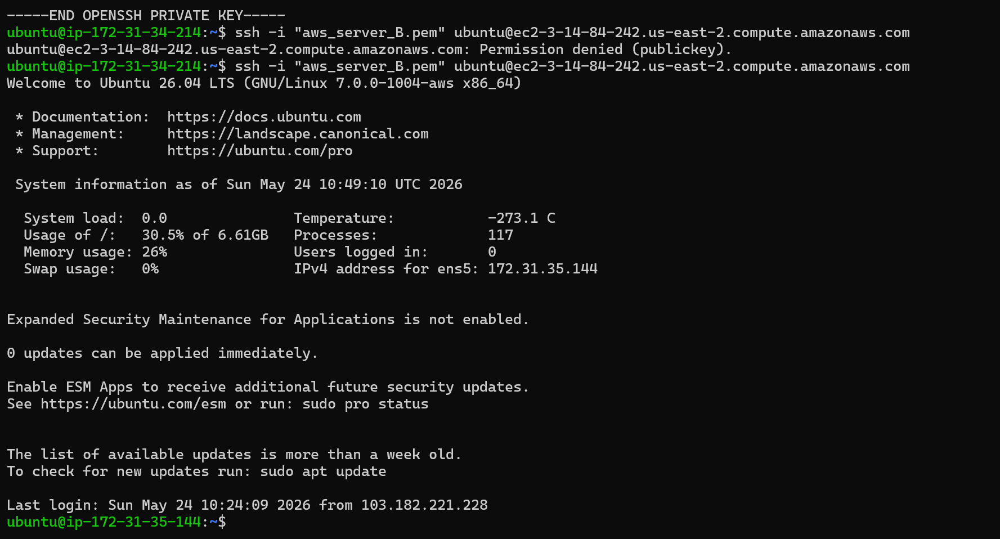
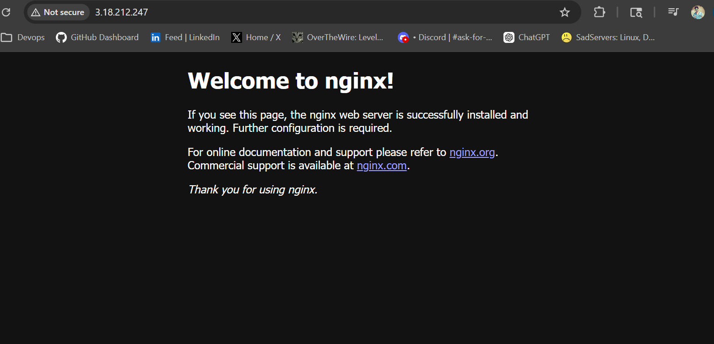
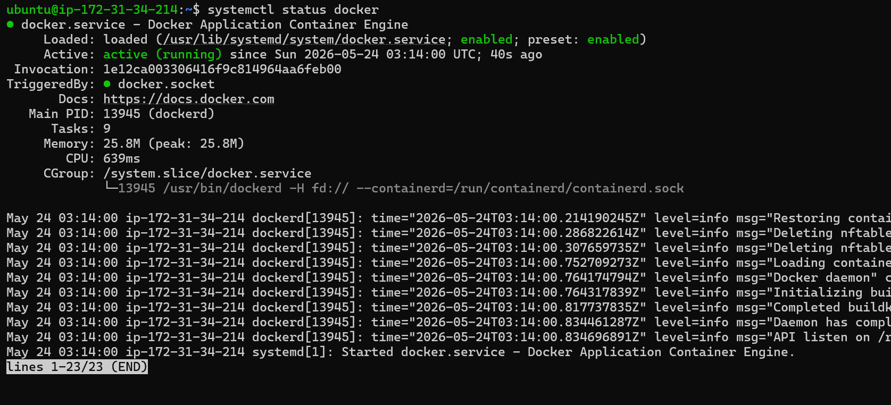

# Day 08 – Cloud Server Setup: Docker, Nginx & Web Deployment

## Objective

Deploy a cloud server, install Docker and Nginx, configure web access, and manage logs.

---

# Commands Used

```bash
sudo apt update && sudo apt upgrade -y
sudo apt install docker.io -y
sudo apt install nginx -y
sudo systemctl enable nginx
sudo systemctl start nginx
sudo systemctl status nginx
sudo tail -f /var/log/nginx/access.log
sudo cp /var/log/nginx/access.log ~/nginx-logs.txt
scp -i your-key.pem ubuntu@YOUR_PUBLIC_IP:~/nginx-logs.txt .
```

---

# Challenges Faced

- Initially port 80 was blocked in the security group.
- Nginx webpage was not opening from browser.
- Fixed by allowing HTTP traffic on port 80.

---

# What I Learned

- How to launch and connect to a cloud server using SSH
- How to install and manage services using systemctl
- How Nginx serves webpages over HTTP
- How to monitor logs from /var/log/nginx/
- Importance of security groups and firewall rules

---

# Why This Matters for DevOps

This task simulated a real production setup process including:

- Cloud provisioning
- Remote server management
- Service deployment
- Network security configuration
- Log management

These are core responsibilities of a DevOps Engineer.

# Screenshots

## SSH Connection



---

## Nginx Welcome Page



---

## Docker and Nginx Status

(nginx.png)
