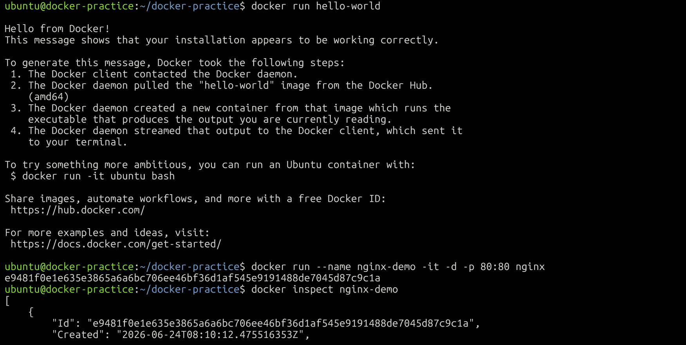
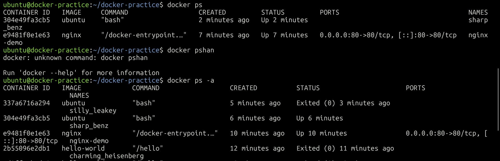
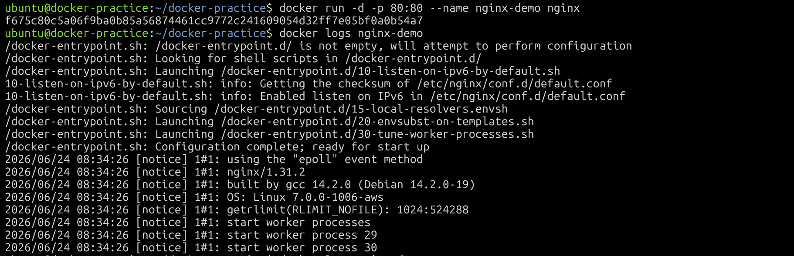
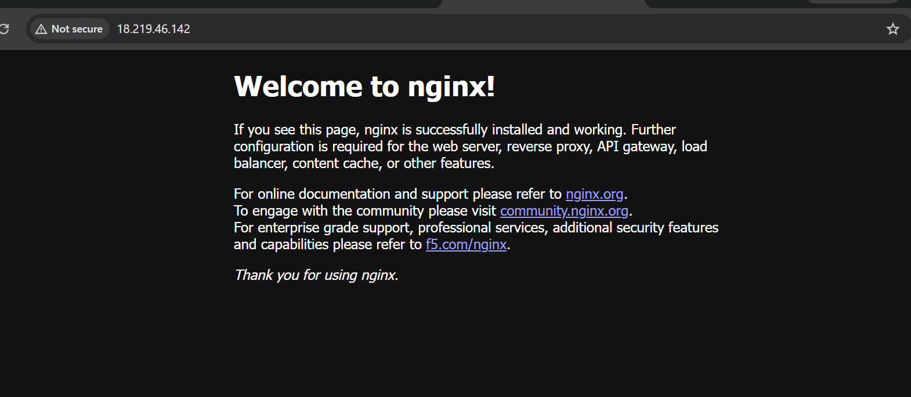
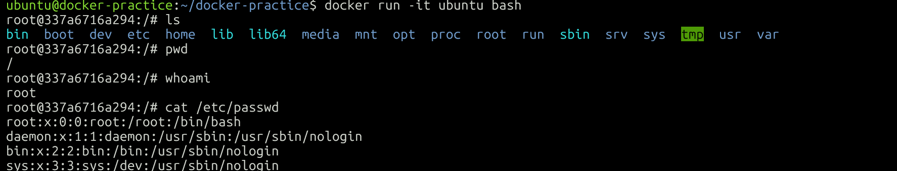

# Day 29 – Introduction to Docker

## 📌 What is Docker?

Docker is an open-source containerization platform that allows developers to package applications along with their dependencies, libraries, and configurations into lightweight units called containers.

Containers ensure that applications run consistently across development, testing, and production environments.

---

## Task 1: What is a Container?

A container is a lightweight, standalone package that contains:

* Application code
* Runtime
* Libraries
* Dependencies
* Configuration files

### Why do we need containers?

* Eliminates "Works on my machine" problems.
* Provides consistent environments.
* Faster application deployment.
* Lightweight compared to virtual machines.
* Better resource utilization.
* Easy scaling and portability.

---

## Containers vs Virtual Machines

| Feature        | Containers   | Virtual Machines  |
| -------------- | ------------ | ----------------- |
| Virtualization | OS Level     | Hardware Level    |
| Startup Time   | Seconds      | Minutes           |
| Size           | MBs          | GBs               |
| Performance    | Near Native  | Moderate Overhead |
| Guest OS       | Not Required | Required          |
| Resource Usage | Low          | High              |
| Portability    | High         | Medium            |

### Real Difference

Virtual machines run a complete operating system with their own kernel.

Containers share the host operating system kernel, making them lightweight and much faster.

---

## Docker Architecture

Docker architecture consists of the following components:

### 1. Docker Client

The Docker CLI used to execute commands.

```bash
docker run nginx
```

### 2. Docker Daemon (dockerd)

Runs in the background and manages:

* Images
* Containers
* Networks
* Volumes

### 3. Docker Images

Read-only templates used to create containers.

Examples:

```bash
nginx:latest
ubuntu:22.04
```

### 4. Docker Containers

Running instances of Docker images.

### 5. Docker Registry

Stores and distributes Docker images.

Example:

* Docker Hub

---

## Docker Architecture Diagram

```text
+------------------+
|  Docker Client   |
+------------------+
          |
          ▼
+------------------+
| Docker Daemon    |
+------------------+
   |         |
   ▼         ▼
Images   Containers
   |
   ▼
Docker Registry
```

---

## Task 2: Install Docker

### Install Docker on Ubuntu

```bash
sudo apt update
sudo apt install docker.io -y
```

### Start Docker Service

```bash
sudo systemctl enable docker
sudo systemctl start docker
```

### Verify Installation

```bash
docker --version
sudo systemctl status docker
```

### Run First Container

```bash
docker run hello-world
```

This command:

* Downloads the image from Docker Hub.
* Creates a container.
* Executes the container.
* Displays a success message.

---

## Task 3: Run Real Containers

### Run Nginx Container

```bash
docker run -d -p 8080:80 nginx
```

Access it in your browser:

```text
http://localhost:8080
```

---

### Run Ubuntu Container

```bash
docker run -it ubuntu bash
```

Inside the container:

```bash
ls
pwd
cat /etc/os-release
```

Exit:

```bash
exit
```

---

### List Running Containers

```bash
docker ps
```

---

### List All Containers

```bash
docker ps -a
```

---

### Stop a Container

```bash
docker stop <container_id>
```

---

### Remove a Container

```bash
docker rm <container_id>
```

---

## Task 4: Explore Docker

### Run Container in Detached Mode

```bash
docker run -d nginx
```

Detached mode runs containers in the background.

---

### Give a Container a Custom Name

```bash
docker run -d --name mynginx nginx
```

---

### Port Mapping

```bash
docker run -d -p 8080:80 nginx
```

* Host Port: 8080
* Container Port: 80

---

### View Container Logs

```bash
docker logs mynginx
```

---

### Execute Commands Inside a Running Container

```bash
docker exec -it mynginx bash
```

If Bash is unavailable:

```bash
docker exec -it mynginx sh
```

---

## Important Docker Commands

```bash
docker --version
docker run hello-world
docker run -d nginx
docker run -d -p 8080:80 nginx
docker run -it ubuntu bash
docker ps
docker ps -a
docker stop <container_id>
docker rm <container_id>
docker logs <container_name>
docker exec -it <container_name> bash
```

---

## Why Docker Matters for DevOps

Docker is the foundation of:

* CI/CD pipelines
* Kubernetes
* Microservices
* Cloud-native applications
* DevOps automation

Benefits:

* Faster deployments
* Environment consistency
* Better scalability
* Easy application packaging
* Reduced infrastructure issues

---

## Conclusion

Today I learned:

✅ What Docker is
✅ Containers and their importance
✅ Containers vs Virtual Machines
✅ Docker Architecture
✅ Running containers
✅ Interactive and detached modes
✅ Port mapping
✅ Logs and container management

Docker is one of the most important tools in modern DevOps and serves as the foundation for Kubernetes and container orchestration.

---

# Screenshots

---

## Hello World Container



---

## Running Containers



---

## Nginx Log



---

## Nginx Web Page



---

## Ubuntu Interactive Container



