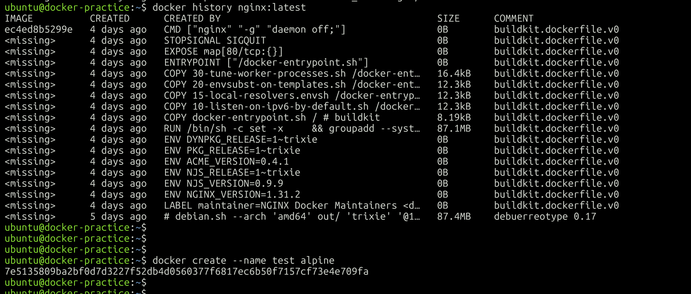
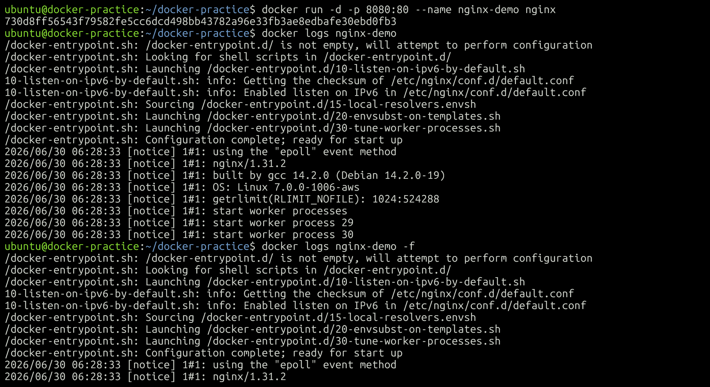
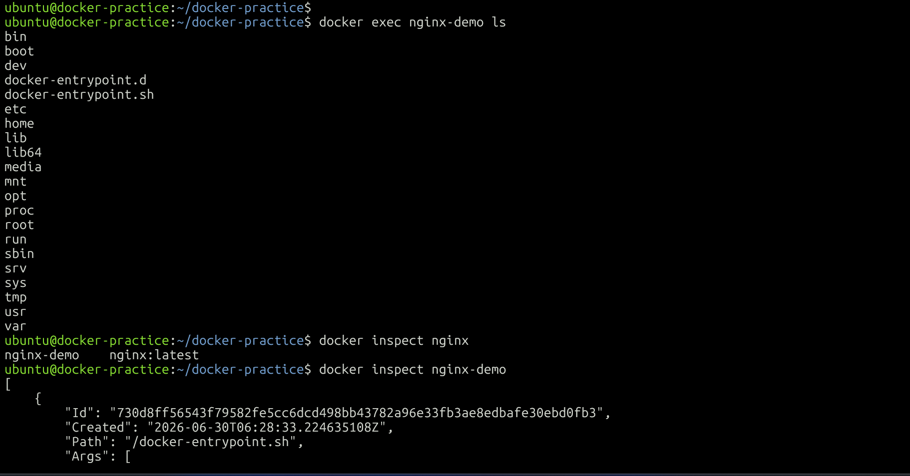
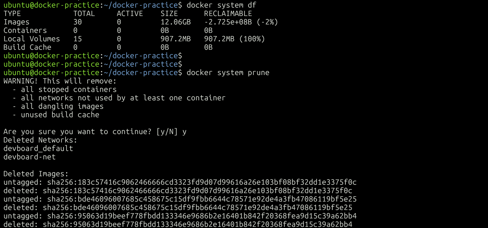

# Day 30 – Docker Images & Container Lifecycle

## 🎯 Objective

Today's goal was to understand:

* Docker Images
* Image Layers
* Container Lifecycle
* Running Containers
* Docker Cleanup Commands

---

# Task 1: Docker Images

## Pull Images

```bash
docker pull nginx
docker pull ubuntu
docker pull alpine
```

---

## List Images

```bash
docker images
```

Example output:

```text
REPOSITORY   TAG       IMAGE ID       SIZE
nginx        latest    xxxxxxxx       192MB
ubuntu       latest    xxxxxxxx       78MB
alpine       latest    xxxxxxxx       8MB
```

### Observation

* Ubuntu image is larger because it contains more packages and utilities.
* Alpine is a lightweight Linux distribution designed for containers.

---

## Inspect an Image

```bash
docker image inspect nginx
```

Information observed:

* Image ID
* Creation date
* Environment variables
* Architecture
* Layers
* Entrypoint

---

## Remove an Image

```bash
docker rmi alpine
```

---

# Task 2: Image Layers

```bash
docker image history nginx
```

### Screenshot



## What are Layers?

Docker images consist of multiple read-only layers.

Each Dockerfile instruction creates a new layer.

### Why Docker Uses Layers

* Faster image builds
* Efficient storage usage
* Layer caching
* Reduced download size

---

# Task 3: Container Lifecycle

## Create Container

```bash
docker create --name mycontainer nginx
```

## Start Container

```bash
docker start mycontainer
```

## Pause Container

```bash
docker pause mycontainer
```

## Unpause Container

```bash
docker unpause mycontainer
```

## Stop Container

```bash
docker stop mycontainer
```

## Restart Container

```bash
docker restart mycontainer
```

## Kill Container

```bash
docker kill mycontainer
```

## Remove Container

```bash
docker rm mycontainer
```

Check the container status after each command:

```bash
docker ps -a
```

### Screenshot


---

# Task 4: Working with Running Containers

## Run Nginx in Detached Mode

```bash
docker run -d --name webserver -p 8080:80 nginx
```

## View Logs

```bash
docker logs webserver
```

## Follow Logs

```bash
docker logs -f webserver
```

### Screenshot



---

## Execute Commands Inside Container

Enter container:

```bash
docker exec -it webserver bash
```

Run a single command:

```bash
docker exec webserver ls /
```

---

## Inspect Container

```bash
docker inspect webserver
```

Information found:

* IP Address
* Port Mapping
* Mounts
* Network Settings

### Screenshot



---

# Task 5: Cleanup

Stop all running containers:

```bash
docker stop $(docker ps -q)
```

Remove stopped containers:

```bash
docker container prune
```

Remove unused images:

```bash
docker image prune
```

Check disk usage:

```bash
docker system df
```

### Screenshot



---

# Key Learnings

* Images are templates used to create containers.
* Containers are running instances of images.
* Docker images use layers.
* Layers improve storage efficiency and build speed.
* Containers move through different lifecycle states.
* Docker provides commands to inspect and clean resources.

---

# Conclusion

Day 30 helped me understand how Docker images and containers work internally. I learned about image layers, container states, inspecting containers, viewing logs, and performing cleanup operations.

